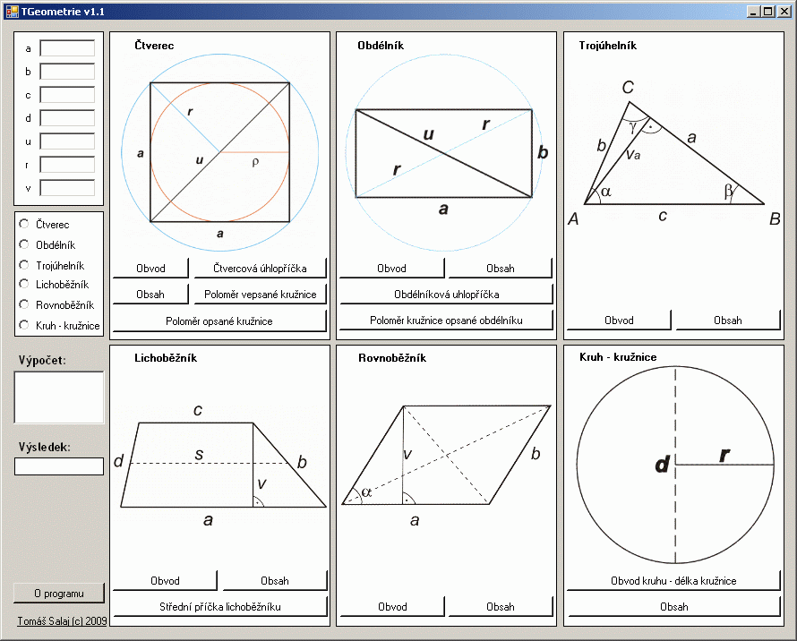

# 🧮 TGeometrie (Geometry) (2009)
by Tom Salaj

---

**My first program from 2009 for calculating basic geometric functions (in Czech language).**  
Completely simple mathematical calculations programmed in Visual Basic.  
Stored here solely for archival and nostalgic purposes.

---

## 📦 About the Program

In this program, you simply enter values to calculate various geometric shapes listed below.  
For better accuracy, you can select a specific shape from the menu on the left –  
the relevant input fields will be highlighted depending on whether you're calculating area, perimeter, etc.  

If you leave a required field empty, the program will notify you.  
After the calculation, the formula used is also displayed.  
The TGeometry program does not require installation.

---

## 🔷 Supported Shapes & Functions

### ◼️ Square
- Perimeter
- Area
- Diagonal
- Radius of the inscribed circle
- Radius of the circumscribed circle

### ◻️ Rectangle
- Perimeter
- Area
- Diagonal
- Radius of the circumscribed circle

### 🔺 Triangle
- Perimeter
- Area

### 🔷 Trapezoid
- Perimeter
- Area
- Median (midsegment)

### ⬒ Parallelogram
- Perimeter
- Area

### ⚪ Circle
- Circumference
- Area

---

## 🖼️ Screenshot

---

## 💾 Download

You can download the executable here:  
👉 [Slunečnice.cz – TGeometrie](https://www.slunecnice.cz/sw/tgeometrie/)

No installation required.

---

## 📁 Files in this Repository

- `Form1.vb` – main program logic
- `TGeometrie.vbproj` – Visual Studio project file (optional)

---

## 🕰️ Notes

This project is not maintained and is archived here for historical and nostalgic reasons.  
Languages: 🇨🇿 Czech only.

---

## 📝 License

This project is released under the [MIT License](LICENSE).  
Use freely, modify as needed. No warranty provided.

---

## 🚀 Final Words

**Learn, code, enjoy — good luck!**  
*Tom Salaj*

